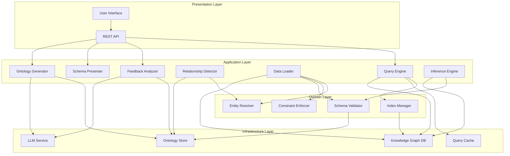
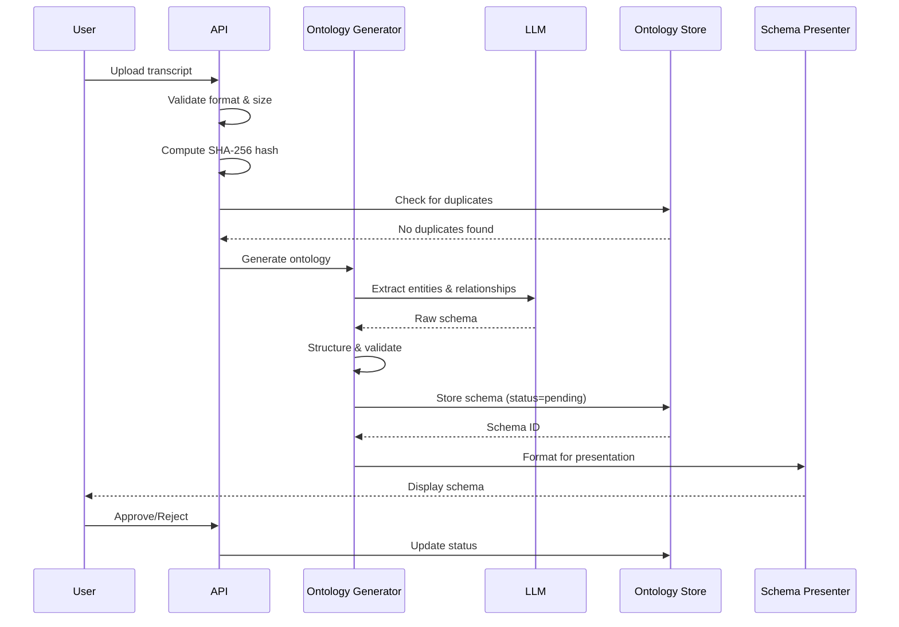
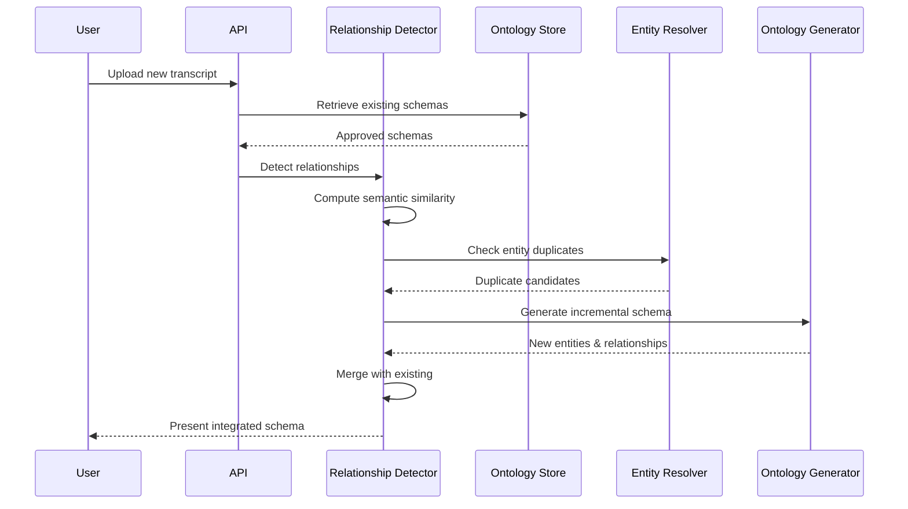
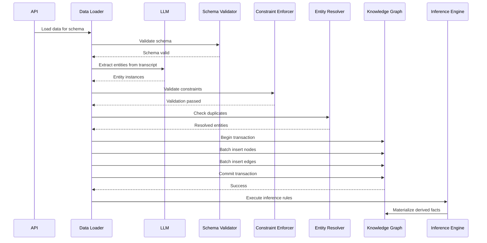
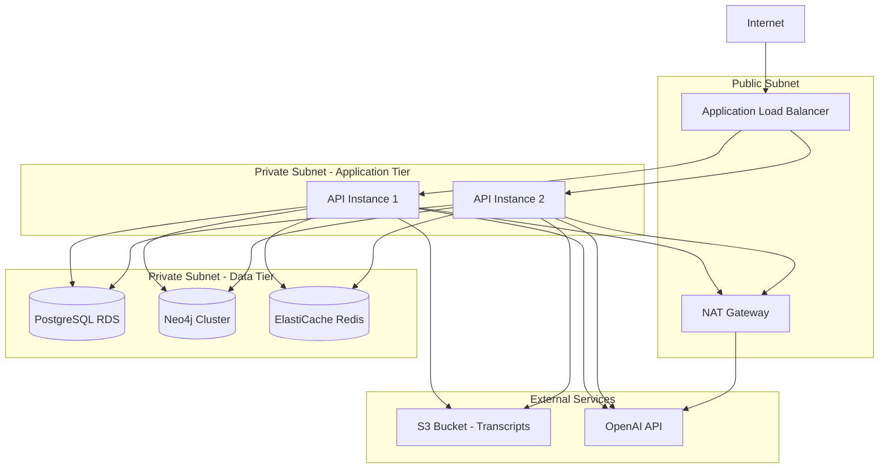

# Design Document: Ontology Knowledge Base System

## Overview

The Ontology Knowledge Base System is a production-grade platform that transforms unstructured transcript documents into structured, queryable knowledge graphs through an iterative, LLM-assisted ontology generation process. The system bridges the gap between domain expert knowledge captured in natural language and formal, machine-processable knowledge representations.

### System Purpose

The system enables domain experts to:
- Upload transcript documents and automatically generate ontology schemas
- Iteratively refine schemas through structured feedback loops
- Build cohesive knowledge structures across multiple documents
- Load validated data into a graph database with full ACID guarantees
- Execute sophisticated graph queries and analytics
- Derive new knowledge through inference rules
- Maintain data quality through duplicate detection and constraint enforcement

### Key Design Principles

1. **Iterative Refinement**: LLM-generated schemas are treated as drafts requiring human validation
2. **Incremental Growth**: New transcripts extend existing ontologies rather than creating isolated structures
3. **Data Integrity**: ACID transactions, constraint enforcement, and validation at every stage
4. **Provenance Tracking**: Complete lineage from source transcripts to derived facts
5. **Scalability**: Batch operations, indexing, and query optimization for large-scale knowledge graphs
6. **Extensibility**: Plugin architecture for inference rules, query languages, and storage backends

## Architecture

### High-Level Architecture


The system follows a layered architecture with clear separation of concerns:



### Component Responsibilities


**Ontology Generator**: Orchestrates LLM invocation to extract entities, relationships, attributes, and constraints from transcript text. Implements retry logic with exponential backoff for LLM failures.

**Schema Presenter**: Formats ontology schemas for human consumption with hierarchical views, statistics, and change highlighting. Generates diff views between schema versions.

**Feedback Analyzer**: Parses user feedback (structured or free-form), identifies required modifications, and coordinates with LLM to generate updated schemas incorporating feedback.

**Relationship Detector**: Analyzes semantic similarity between new transcript content and existing ontologies using embedding-based similarity scoring. Identifies entity matches, new relationships, and potential conflicts.

**Ontology Store**: Persistent storage for ontology schemas with versioning, metadata management, and efficient retrieval by various criteria. Implements atomic transactions for schema operations.

**Data Loader**: Extracts entities and relationships from transcripts using LLM, validates against schema constraints, and performs batch insertion into the Knowledge Graph with provenance tracking.

**Knowledge Graph**: Graph database storing entities as nodes and relationships as edges. Supports ACID transactions, indexing, constraint enforcement, and standard query languages.

**Inference Engine**: Executes logical rules to derive new facts from existing data. Supports both materialized (stored) and virtual (computed on-demand) inference with provenance tracking.

**Query Engine**: Processes graph queries in standard languages (Cypher/SPARQL/Gremlin), optimizes execution plans, manages query cache, and computes graph analytics.

**Schema Validator**: Validates ontology schemas for structural correctness, semantic consistency, and logical satisfiability. Detects circular dependencies, conflicting constraints, and unsatisfiable definitions.

**Entity Resolver**: Detects duplicate entities using fingerprinting and similarity scoring. Implements merge strategies and maintains provenance for merged entities.

**Constraint Enforcer**: Validates data against ontology constraints including cardinality, domain/range, disjointness, and property value constraints. Operates during data loading and updates.

**Index Manager**: Automatically creates and maintains indexes on entity identifiers and frequently-queried properties. Monitors query patterns and recommends optimizations.

### Technology Stack Recommendations


**Graph Database**: Neo4j (recommended) or Amazon Neptune
- Native graph storage with optimized traversal algorithms
- Cypher query language support
- ACID transactions with distributed locking
- Built-in indexing and constraint enforcement
- Mature ecosystem with monitoring and backup tools

**Ontology Store**: PostgreSQL with JSONB columns
- ACID guarantees for schema versioning
- Efficient JSONB indexing for schema queries
- Strong consistency for concurrent operations
- Proven reliability for metadata management

**LLM Integration**: OpenAI GPT-4 or Anthropic Claude via API
- Structured output support for schema generation
- Function calling for feedback incorporation
- Retry logic with exponential backoff
- Rate limiting and cost management

**Embedding Service**: OpenAI text-embedding-3-large or sentence-transformers
- Semantic similarity computation for duplicate detection
- Relationship detection between transcripts
- Entity matching across ontologies

**Caching Layer**: Redis
- Query result caching with TTL
- Distributed locking for concurrent operations
- Session management for multi-step workflows

**API Framework**: FastAPI (Python) or Spring Boot (Java)
- RESTful API with OpenAPI documentation
- Synchronous request handling with extended timeouts (5-10 minutes for long operations)
- Built-in validation and error handling
- Configurable timeout settings for transcript processing and data loading

### Data Flow


#### Initial Ontology Generation Flow



#### Incremental Update Flow



#### Data Loading Flow




## Components and Interfaces

### Ontology Generator

**Responsibilities**:
- Invoke LLM with transcript text and generation prompts
- Parse LLM responses into structured schema format
- Implement retry logic for transient failures
- Validate generated schemas for completeness

**Interface**:
```python
class OntologyGenerator:
    def generate_schema(
        self, 
        transcript: Transcript,
        existing_schemas: List[OntologySchema] = None
    ) -> OntologySchema:
        """Generate ontology schema from transcript.
        
        Args:
            transcript: Source transcript with text content
            existing_schemas: Optional existing schemas for incremental generation
            
        Returns:
            Generated ontology schema with pending status
            
        Raises:
            LLMServiceError: If LLM invocation fails after retries
            ValidationError: If generated schema is invalid
        """
        pass
    
    def refine_schema(
        self,
        schema: OntologySchema,
        feedback: UserFeedback,
        transcript: Transcript
    ) -> OntologySchema:
        """Refine schema based on user feedback.
        
        Args:
            schema: Current schema version
            feedback: Structured user feedback
            transcript: Original source transcript
            
        Returns:
            Updated schema incorporating feedback
        """
        pass
```


### Schema Presenter

**Responsibilities**:
- Format schemas for human readability
- Generate hierarchical and visual representations
- Compute schema statistics and metadata
- Create diff views between versions

**Interface**:
```python
class SchemaPresenter:
    def format_schema(
        self,
        schema: OntologySchema,
        format: PresentationFormat = PresentationFormat.HIERARCHICAL
    ) -> str:
        """Format schema for presentation.
        
        Args:
            schema: Ontology schema to format
            format: Desired presentation format
            
        Returns:
            Formatted schema string
        """
        pass
    
    def generate_diff(
        self,
        old_schema: OntologySchema,
        new_schema: OntologySchema
    ) -> SchemaDiff:
        """Generate diff between schema versions.
        
        Args:
            old_schema: Previous schema version
            new_schema: Updated schema version
            
        Returns:
            Structured diff showing additions, modifications, deletions
        """
        pass
    
    def compute_statistics(self, schema: OntologySchema) -> SchemaStatistics:
        """Compute schema statistics.
        
        Returns:
            Statistics including entity count, relationship count, etc.
        """
        pass
```

### Relationship Detector

**Responsibilities**:
- Compute semantic similarity between transcripts and schemas
- Identify entity matches across ontologies
- Detect new relationships connecting to existing entities
- Generate incremental update proposals

**Interface**:
```python
class RelationshipDetector:
    def detect_relationships(
        self,
        new_transcript: Transcript,
        existing_schemas: List[OntologySchema]
    ) -> RelationshipAnalysis:
        """Detect relationships between new content and existing schemas.
        
        Args:
            new_transcript: New transcript to analyze
            existing_schemas: Existing approved schemas
            
        Returns:
            Analysis containing matched entities, new relationships, conflicts
        """
        pass
    
    def compute_similarity(
        self,
        text1: str,
        text2: str
    ) -> float:
        """Compute semantic similarity between texts.
        
        Returns:
            Similarity score between 0.0 and 1.0
        """
        pass
```


### Entity Resolver

**Responsibilities**:
- Compute entity fingerprints for duplicate detection
- Calculate similarity scores between entities
- Implement merge strategies for duplicate entities
- Maintain provenance for merged entities

**Interface**:
```python
class EntityResolver:
    def detect_duplicates(
        self,
        entities: List[Entity],
        threshold: float = 0.9
    ) -> List[DuplicatePair]:
        """Detect duplicate entities.
        
        Args:
            entities: List of entities to check
            threshold: Similarity threshold for duplicate detection
            
        Returns:
            List of duplicate pairs with similarity scores
        """
        pass
    
    def merge_entities(
        self,
        entity1: Entity,
        entity2: Entity,
        strategy: MergeStrategy
    ) -> Entity:
        """Merge duplicate entities.
        
        Args:
            entity1: First entity
            entity2: Second entity
            strategy: Merge strategy (keep-first, keep-second, merge-attributes)
            
        Returns:
            Merged entity with combined attributes
        """
        pass
    
    def compute_fingerprint(self, entity: Entity) -> str:
        """Compute entity fingerprint for duplicate detection.
        
        Returns:
            Normalized fingerprint string
        """
        pass
```

### Data Loader

**Responsibilities**:
- Extract entity instances from transcripts using LLM
- Validate data against schema constraints
- Perform batch insertion into Knowledge Graph
- Track provenance metadata

**Interface**:
```python
class DataLoader:
    def load_data(
        self,
        schema: OntologySchema,
        transcript: Transcript
    ) -> LoadResult:
        """Load data into knowledge graph.
        
        Args:
            schema: Finalized ontology schema
            transcript: Source transcript
            
        Returns:
            Load result with statistics and errors
            
        Raises:
            ValidationError: If data violates schema constraints
            TransactionError: If database transaction fails
        """
        pass
    
    def validate_data(
        self,
        entities: List[EntityInstance],
        relationships: List[RelationshipInstance],
        schema: OntologySchema
    ) -> ValidationResult:
        """Validate data against schema.
        
        Returns:
            Validation result with any constraint violations
        """
        pass
```


### Inference Engine

**Responsibilities**:
- Execute logical inference rules on graph data
- Support materialized and virtual inference modes
- Track derivation chains for inferred facts
- Handle inference conflicts

**Interface**:
```python
class InferenceEngine:
    def execute_rules(
        self,
        rules: List[InferenceRule],
        mode: InferenceMode = InferenceMode.MATERIALIZED
    ) -> InferenceResult:
        """Execute inference rules on knowledge graph.
        
        Args:
            rules: List of inference rules to execute
            mode: Materialized (store) or virtual (compute on-demand)
            
        Returns:
            Inference result with derived facts and statistics
        """
        pass
    
    def validate_rule(self, rule: InferenceRule) -> ValidationResult:
        """Validate inference rule for correctness.
        
        Returns:
            Validation result indicating if rule is valid
        """
        pass
    
    def detect_conflicts(
        self,
        inferred_facts: List[Fact]
    ) -> List[InferenceConflict]:
        """Detect conflicts in inferred facts.
        
        Returns:
            List of conflicts where rules derive contradictory facts
        """
        pass
```

### Query Engine

**Responsibilities**:
- Parse and execute graph queries
- Optimize query execution plans
- Manage query result cache
- Compute graph analytics

**Interface**:
```python
class QueryEngine:
    def execute_query(
        self,
        query: str,
        language: QueryLanguage = QueryLanguage.CYPHER,
        timeout: int = 30
    ) -> QueryResult:
        """Execute graph query.
        
        Args:
            query: Query string in specified language
            language: Query language (Cypher, SPARQL, Gremlin)
            timeout: Query timeout in seconds
            
        Returns:
            Query result with data and execution metadata
            
        Raises:
            QueryTimeoutError: If query exceeds timeout
            QuerySyntaxError: If query syntax is invalid
        """
        pass
    
    def explain_query(self, query: str) -> ExecutionPlan:
        """Generate query execution plan without executing.
        
        Returns:
            Execution plan showing traversal strategy and costs
        """
        pass
    
    def compute_analytics(
        self,
        metric: GraphMetric,
        subgraph: Optional[SubgraphFilter] = None
    ) -> AnalyticsResult:
        """Compute graph analytics metrics.
        
        Args:
            metric: Metric to compute (centrality, clustering, etc.)
            subgraph: Optional filter to compute on subgraph
            
        Returns:
            Analytics result with computed values
        """
        pass
```


### Schema Validator

**Responsibilities**:
- Validate schema structural correctness
- Check semantic consistency
- Detect circular dependencies and unsatisfiable definitions
- Verify constraint compatibility

**Interface**:
```python
class SchemaValidator:
    def validate_schema(
        self,
        schema: OntologySchema
    ) -> ValidationResult:
        """Validate ontology schema.
        
        Returns:
            Validation result with any errors or warnings
        """
        pass
    
    def check_consistency(
        self,
        schema: OntologySchema
    ) -> ConsistencyResult:
        """Check schema logical consistency.
        
        Returns:
            Consistency result identifying contradictions
        """
        pass
    
    def detect_circular_dependencies(
        self,
        schema: OntologySchema
    ) -> List[CircularDependency]:
        """Detect circular inheritance chains.
        
        Returns:
            List of circular dependency chains
        """
        pass
```

### Constraint Enforcer

**Responsibilities**:
- Validate cardinality constraints
- Enforce domain and range constraints
- Check disjointness constraints
- Validate property value constraints

**Interface**:
```python
class ConstraintEnforcer:
    def enforce_constraints(
        self,
        entities: List[EntityInstance],
        relationships: List[RelationshipInstance],
        schema: OntologySchema
    ) -> ConstraintResult:
        """Enforce all schema constraints.
        
        Returns:
            Constraint result with violations
        """
        pass
    
    def validate_cardinality(
        self,
        entity: EntityInstance,
        relationship_type: str,
        schema: OntologySchema
    ) -> bool:
        """Validate relationship cardinality for entity.
        
        Returns:
            True if cardinality constraints satisfied
        """
        pass
```

## Data Models

### Core Domain Models


#### Transcript

```python
@dataclass
class Transcript:
    id: str  # UUID
    filename: str
    content: str  # Extracted text
    content_hash: str  # SHA-256 hash
    format: FileFormat  # TXT, PDF, DOCX, MARKDOWN
    size_bytes: int
    upload_timestamp: datetime
    user_id: str
    metadata: Dict[str, Any]
```

#### OntologySchema

```python
@dataclass
class OntologySchema:
    id: str  # UUID
    version: int
    status: ApprovalStatus  # PENDING, APPROVED, REJECTED, FINALIZED
    entities: List[EntityDefinition]
    relationships: List[RelationshipDefinition]
    constraints: List[SemanticConstraint]
    source_transcript_id: str
    parent_schema_id: Optional[str]  # For incremental updates
    created_at: datetime
    approved_at: Optional[datetime]
    approved_by: Optional[str]
    metadata: SchemaMetadata

@dataclass
class SchemaMetadata:
    entity_count: int
    relationship_count: int
    constraint_count: int
    generation_model: str  # LLM model used
    confidence_score: float
```

#### EntityDefinition

```python
@dataclass
class EntityDefinition:
    id: str  # Unique identifier
    label: str  # Human-readable name
    description: str
    attributes: List[AttributeDefinition]
    parent_entity_id: Optional[str]  # For hierarchies
    is_abstract: bool
    constraints: List[EntityConstraint]

@dataclass
class AttributeDefinition:
    name: str
    data_type: DataType  # STRING, INT, FLOAT, BOOL, DATE, DATETIME
    is_required: bool
    is_unique: bool
    default_value: Optional[Any]
    validation_rules: List[ValidationRule]
```

#### RelationshipDefinition

```python
@dataclass
class RelationshipDefinition:
    id: str
    label: str
    description: str
    source_entity_id: str
    target_entity_id: str
    relationship_type: RelationshipType
    cardinality: Cardinality  # ONE_TO_ONE, ONE_TO_MANY, MANY_TO_ONE, MANY_TO_MANY
    is_symmetric: bool
    inverse_relationship_id: Optional[str]
    properties: List[AttributeDefinition]

@dataclass
class Cardinality:
    min_count: Optional[int]  # None = no minimum
    max_count: Optional[int]  # None = unbounded
```


#### SemanticConstraint

```python
@dataclass
class SemanticConstraint:
    id: str
    constraint_type: ConstraintType  # DOMAIN, RANGE, DISJOINTNESS, VALUE, FUNCTIONAL
    description: str
    applies_to: str  # Entity or relationship ID
    validation_expression: str  # Logical expression
    severity: Severity  # ERROR, WARNING

@dataclass
class ValidationRule:
    rule_type: RuleType  # MIN_VALUE, MAX_VALUE, REGEX, ENUM, CUSTOM
    parameters: Dict[str, Any]
    error_message: str
```

#### EntityInstance (Runtime Data)

```python
@dataclass
class EntityInstance:
    id: str  # UUID
    entity_type_id: str  # References EntityDefinition
    label: str
    properties: Dict[str, Any]
    provenance: ProvenanceMetadata
    created_at: datetime
    updated_at: datetime

@dataclass
class RelationshipInstance:
    id: str  # UUID
    relationship_type_id: str  # References RelationshipDefinition
    source_entity_id: str
    target_entity_id: str
    properties: Dict[str, Any]
    provenance: ProvenanceMetadata
    created_at: datetime
```

#### ProvenanceMetadata

```python
@dataclass
class ProvenanceMetadata:
    source_transcript_id: str
    schema_version: int
    extraction_timestamp: datetime
    extraction_method: str  # LLM, MANUAL, INFERRED
    inference_rule_id: Optional[str]  # If derived
    derivation_chain: List[str]  # Entity IDs in derivation
    confidence_score: float
```

#### InferenceRule

```python
@dataclass
class InferenceRule:
    id: str
    name: str
    description: str
    rule_type: InferenceRuleType  # TRANSITIVE, SYMMETRIC, INVERSE, INHERITANCE, CONDITIONAL
    rule_definition: str  # Logical expression
    priority: int
    is_active: bool
    created_at: datetime
    created_by: str

class InferenceRuleType(Enum):
    TRANSITIVE = "transitive"  # If A->B and B->C then A->C
    SYMMETRIC = "symmetric"  # If A->B then B->A
    INVERSE = "inverse"  # If A->B then B->A' (different relationship)
    INHERITANCE = "inheritance"  # Propagate properties through hierarchy
    CONDITIONAL = "conditional"  # IF condition THEN conclusion
```

### Database Schema (Knowledge Graph)


#### Neo4j Schema Design

**Node Labels**: Dynamically created from EntityDefinition labels

**Node Properties**:
- `id`: String (UUID, indexed, unique)
- `entity_type_id`: String (references EntityDefinition)
- `label`: String (indexed)
- `created_at`: DateTime
- `updated_at`: DateTime
- `source_transcript_id`: String (indexed)
- `schema_version`: Integer
- `is_inferred`: Boolean
- Custom properties from AttributeDefinition

**Relationship Types**: Dynamically created from RelationshipDefinition labels

**Relationship Properties**:
- `id`: String (UUID)
- `relationship_type_id`: String
- `created_at`: DateTime
- `source_transcript_id`: String
- `is_inferred`: Boolean
- `inference_rule_id`: String (if inferred)
- Custom properties from RelationshipDefinition

**Indexes**:
```cypher
CREATE INDEX entity_id_index FOR (n:Entity) ON (n.id);
CREATE INDEX entity_label_index FOR (n:Entity) ON (n.label);
CREATE INDEX entity_type_index FOR (n:Entity) ON (n.entity_type_id);
CREATE INDEX transcript_index FOR (n:Entity) ON (n.source_transcript_id);
CREATE FULLTEXT INDEX entity_text_index FOR (n:Entity) ON EACH [n.label, n.description];
```

**Constraints**:
```cypher
CREATE CONSTRAINT entity_id_unique FOR (n:Entity) REQUIRE n.id IS UNIQUE;
```

### Ontology Store Schema (PostgreSQL)

```sql
CREATE TABLE transcripts (
    id UUID PRIMARY KEY,
    filename VARCHAR(255) NOT NULL,
    content TEXT NOT NULL,
    content_hash CHAR(64) NOT NULL,  -- SHA-256
    format VARCHAR(20) NOT NULL,
    size_bytes INTEGER NOT NULL,
    upload_timestamp TIMESTAMP NOT NULL,
    user_id VARCHAR(255) NOT NULL,
    metadata JSONB,
    CONSTRAINT check_size CHECK (size_bytes <= 52428800)  -- 50MB
);

CREATE INDEX idx_transcript_hash ON transcripts(content_hash);
CREATE INDEX idx_transcript_user ON transcripts(user_id);

CREATE TABLE ontology_schemas (
    id UUID PRIMARY KEY,
    version INTEGER NOT NULL,
    status VARCHAR(20) NOT NULL,
    schema_definition JSONB NOT NULL,
    source_transcript_id UUID NOT NULL REFERENCES transcripts(id),
    parent_schema_id UUID REFERENCES ontology_schemas(id),
    created_at TIMESTAMP NOT NULL,
    approved_at TIMESTAMP,
    approved_by VARCHAR(255),
    metadata JSONB,
    CONSTRAINT check_status CHECK (status IN ('PENDING', 'APPROVED', 'REJECTED', 'FINALIZED'))
);

CREATE INDEX idx_schema_status ON ontology_schemas(status);
CREATE INDEX idx_schema_transcript ON ontology_schemas(source_transcript_id);
CREATE INDEX idx_schema_version ON ontology_schemas(id, version);
CREATE INDEX idx_schema_definition ON ontology_schemas USING GIN(schema_definition);

CREATE TABLE schema_versions (
    schema_id UUID NOT NULL REFERENCES ontology_schemas(id),
    version INTEGER NOT NULL,
    change_type VARCHAR(50) NOT NULL,
    change_description TEXT,
    changed_by VARCHAR(255) NOT NULL,
    changed_at TIMESTAMP NOT NULL,
    diff JSONB,
    PRIMARY KEY (schema_id, version)
);

CREATE TABLE user_feedback (
    id UUID PRIMARY KEY,
    schema_id UUID NOT NULL REFERENCES ontology_schemas(id),
    user_id VARCHAR(255) NOT NULL,
    feedback_text TEXT NOT NULL,
    feedback_type VARCHAR(20) NOT NULL,
    created_at TIMESTAMP NOT NULL,
    processed BOOLEAN DEFAULT FALSE
);

CREATE TABLE inference_rules (
    id UUID PRIMARY KEY,
    name VARCHAR(255) NOT NULL,
    description TEXT,
    rule_type VARCHAR(50) NOT NULL,
    rule_definition TEXT NOT NULL,
    priority INTEGER DEFAULT 0,
    is_active BOOLEAN DEFAULT TRUE,
    created_at TIMESTAMP NOT NULL,
    created_by VARCHAR(255) NOT NULL
);

CREATE TABLE audit_log (
    id UUID PRIMARY KEY,
    timestamp TIMESTAMP NOT NULL,
    user_id VARCHAR(255) NOT NULL,
    operation VARCHAR(100) NOT NULL,
    resource_type VARCHAR(50) NOT NULL,
    resource_id UUID NOT NULL,
    details JSONB,
    ip_address VARCHAR(45)
);

CREATE INDEX idx_audit_timestamp ON audit_log(timestamp);
CREATE INDEX idx_audit_user ON audit_log(user_id);
CREATE INDEX idx_audit_resource ON audit_log(resource_type, resource_id);
```

### API Design


#### Transcript Management

```
POST /api/v1/transcripts
Content-Type: multipart/form-data

Request:
- file: File (TXT, PDF, DOCX, Markdown)
- metadata: JSON (optional)

Response: 201 Created
{
  "transcript_id": "uuid",
  "filename": "document.txt",
  "content_hash": "sha256...",
  "size_bytes": 12345,
  "upload_timestamp": "2024-01-15T10:30:00Z",
  "duplicate_detected": false
}

GET /api/v1/transcripts/{transcript_id}
Response: 200 OK
{
  "transcript_id": "uuid",
  "filename": "document.txt",
  "content": "extracted text...",
  "metadata": {...}
}
```

#### Ontology Generation

```
POST /api/v1/ontologies/generate
Content-Type: application/json

Request:
{
  "transcript_id": "uuid",
  "generation_options": {
    "check_existing": true,
    "merge_strategy": "auto"
  }
}

Response: 200 OK (may take several minutes for large transcripts)
{
  "schema_id": "uuid",
  "status": "completed",
  "schema": {...},
  "processing_time_seconds": 45
}
```

#### Schema Management

```
GET /api/v1/schemas/{schema_id}
Response: 200 OK
{
  "schema_id": "uuid",
  "version": 1,
  "status": "pending",
  "entities": [...],
  "relationships": [...],
  "constraints": [...],
  "metadata": {...}
}

POST /api/v1/schemas/{schema_id}/approve
Request:
{
  "approved": true,
  "comments": "Looks good"
}

Response: 200 OK
{
  "schema_id": "uuid",
  "status": "approved",
  "approved_at": "2024-01-15T10:40:00Z"
}

POST /api/v1/schemas/{schema_id}/feedback
Request:
{
  "feedback_text": "Add relationship between Entity A and Entity B",
  "feedback_type": "modification"
}

Response: 200 OK (may take 30-60 seconds)
{
  "schema_id": "uuid",
  "new_version": 2,
  "status": "pending",
  "schema": {...}
}
```

#### Data Loading

```
POST /api/v1/knowledge-graph/load
Request:
{
  "schema_id": "uuid",
  "transcript_id": "uuid",
  "options": {
    "batch_size": 1000,
    "resolve_duplicates": true
  }
}

Response: 200 OK (may take several minutes for large datasets)
{
  "status": "completed",
  "statistics": {
    "nodes_created": 150,
    "edges_created": 200,
    "duplicates_resolved": 5,
    "errors": 0,
    "processing_time_seconds": 120
  }
}
```

#### Query Execution

```
POST /api/v1/knowledge-graph/query
Request:
{
  "query": "MATCH (n:Person)-[:KNOWS]->(m:Person) RETURN n, m LIMIT 10",
  "language": "cypher",
  "timeout": 30
}

Response: 200 OK
{
  "results": [...],
  "execution_time_ms": 45,
  "result_count": 10,
  "has_more": false
}

POST /api/v1/knowledge-graph/query/explain
Request:
{
  "query": "MATCH (n:Person)-[:KNOWS]->(m:Person) RETURN n, m"
}

Response: 200 OK
{
  "execution_plan": {
    "steps": [...],
    "estimated_cost": 1000,
    "uses_indexes": ["entity_id_index"]
  }
}
```

#### Inference Management

```
POST /api/v1/inference/rules
Request:
{
  "name": "Transitive Knows",
  "rule_type": "transitive",
  "rule_definition": "IF (A)-[:KNOWS]->(B) AND (B)-[:KNOWS]->(C) THEN (A)-[:KNOWS_INDIRECTLY]->(C)",
  "priority": 10
}

Response: 201 Created
{
  "rule_id": "uuid",
  "name": "Transitive Knows",
  "is_active": true
}

POST /api/v1/inference/execute
Request:
{
  "rule_ids": ["uuid1", "uuid2"],
  "mode": "materialized"
}

Response: 200 OK (may take several seconds)
{
  "status": "completed",
  "statistics": {
    "rules_fired": 2,
    "facts_derived": 50,
    "execution_time_ms": 3500
  }
}
```

### Algorithms


#### Duplicate Detection Algorithm

```python
def detect_duplicate_entities(
    new_entities: List[EntityInstance],
    existing_entities: List[EntityInstance],
    threshold: float = 0.9
) -> List[DuplicatePair]:
    """
    Detect duplicate entities using fingerprinting and similarity scoring.
    
    Algorithm:
    1. Compute normalized fingerprints for all entities
    2. Group entities by fingerprint prefix for candidate generation
    3. Compute pairwise similarity for candidates
    4. Return pairs exceeding threshold
    
    Complexity: O(n log n) with fingerprint bucketing
    """
    duplicates = []
    
    # Step 1: Compute fingerprints
    fingerprints = {}
    for entity in new_entities + existing_entities:
        fp = compute_fingerprint(entity)
        fingerprints[entity.id] = fp
    
    # Step 2: Bucket by fingerprint prefix (first 4 chars)
    buckets = defaultdict(list)
    for entity in new_entities:
        prefix = fingerprints[entity.id][:4]
        buckets[prefix].append(entity)
    
    # Step 3: Compare within buckets
    for entity in new_entities:
        prefix = fingerprints[entity.id][:4]
        candidates = [e for e in existing_entities 
                     if fingerprints[e.id].startswith(prefix)]
        
        for candidate in candidates:
            similarity = compute_entity_similarity(entity, candidate)
            if similarity >= threshold:
                duplicates.append(DuplicatePair(
                    entity1=entity,
                    entity2=candidate,
                    similarity=similarity
                ))
    
    return duplicates

def compute_fingerprint(entity: EntityInstance) -> str:
    """
    Compute normalized fingerprint for entity.
    
    Steps:
    1. Normalize label (lowercase, remove punctuation)
    2. Extract key attributes (name, identifier, etc.)
    3. Concatenate and hash
    """
    normalized_label = normalize_text(entity.label)
    key_attrs = extract_key_attributes(entity.properties)
    fingerprint_text = f"{normalized_label}|{key_attrs}"
    return hashlib.sha256(fingerprint_text.encode()).hexdigest()

def compute_entity_similarity(e1: EntityInstance, e2: EntityInstance) -> float:
    """
    Compute similarity between entities using weighted features.
    
    Features:
    - Label similarity (40% weight): Levenshtein distance
    - Attribute overlap (40% weight): Jaccard similarity
    - Type compatibility (20% weight): Entity type hierarchy
    """
    label_sim = 1.0 - (levenshtein(e1.label, e2.label) / 
                       max(len(e1.label), len(e2.label)))
    
    attr_sim = jaccard_similarity(
        set(e1.properties.keys()),
        set(e2.properties.keys())
    )
    
    type_sim = compute_type_similarity(e1.entity_type_id, e2.entity_type_id)
    
    return 0.4 * label_sim + 0.4 * attr_sim + 0.2 * type_sim
```

#### Relationship Detection Algorithm

```python
def detect_relationships(
    new_transcript: Transcript,
    existing_schemas: List[OntologySchema],
    threshold: float = 0.8
) -> RelationshipAnalysis:
    """
    Detect relationships between new content and existing ontologies.
    
    Algorithm:
    1. Compute semantic embeddings for new transcript
    2. Compute embeddings for existing schema entities
    3. Find entity matches using cosine similarity
    4. Identify potential relationships
    5. Validate against schema constraints
    
    Complexity: O(n * m) where n=new entities, m=existing entities
    """
    # Step 1: Extract entities from new transcript
    new_entities = extract_entities_from_transcript(new_transcript)
    
    # Step 2: Compute embeddings
    new_embeddings = compute_embeddings([e.label for e in new_entities])
    
    existing_entities = []
    existing_embeddings = []
    for schema in existing_schemas:
        for entity_def in schema.entities:
            existing_entities.append(entity_def)
            existing_embeddings.append(compute_embedding(entity_def.label))
    
    # Step 3: Find matches using cosine similarity
    matches = []
    for i, new_entity in enumerate(new_entities):
        for j, existing_entity in enumerate(existing_entities):
            similarity = cosine_similarity(
                new_embeddings[i],
                existing_embeddings[j]
            )
            if similarity >= threshold:
                matches.append(EntityMatch(
                    new_entity=new_entity,
                    existing_entity=existing_entity,
                    similarity=similarity
                ))
    
    # Step 4: Identify potential relationships
    potential_relationships = []
    for match in matches:
        # Check if new entity has relationships to other matched entities
        for other_match in matches:
            if has_relationship_in_transcript(
                new_transcript,
                match.new_entity,
                other_match.new_entity
            ):
                potential_relationships.append(
                    PotentialRelationship(
                        source=match.existing_entity,
                        target=other_match.existing_entity,
                        evidence=extract_relationship_evidence(new_transcript)
                    )
                )
    
    # Step 5: Validate against constraints
    validated_relationships = []
    for rel in potential_relationships:
        if validate_relationship_constraints(rel, existing_schemas):
            validated_relationships.append(rel)
    
    return RelationshipAnalysis(
        entity_matches=matches,
        new_relationships=validated_relationships,
        conflicts=detect_conflicts(validated_relationships, existing_schemas)
    )
```


#### Inference Execution Algorithm

```python
def execute_inference_rules(
    rules: List[InferenceRule],
    graph: KnowledgeGraph,
    mode: InferenceMode
) -> InferenceResult:
    """
    Execute inference rules to derive new facts.
    
    Algorithm:
    1. Sort rules by priority
    2. For each rule, find matching patterns in graph
    3. Derive new facts from matches
    4. Detect and resolve conflicts
    5. Materialize or mark as virtual
    
    Complexity: Depends on rule complexity, typically O(n^k) where k=pattern size
    """
    derived_facts = []
    conflicts = []
    
    # Step 1: Sort by priority (higher priority first)
    sorted_rules = sorted(rules, key=lambda r: r.priority, reverse=True)
    
    # Step 2: Execute each rule
    for rule in sorted_rules:
        if not rule.is_active:
            continue
        
        # Find pattern matches
        matches = find_pattern_matches(rule, graph)
        
        # Derive facts from matches
        for match in matches:
            new_fact = derive_fact(rule, match)
            
            # Check for conflicts with existing facts
            conflict = check_conflict(new_fact, derived_facts, graph)
            if conflict:
                conflicts.append(conflict)
                # Use priority to resolve
                if rule.priority > conflict.existing_rule_priority:
                    derived_facts.append(new_fact)
            else:
                derived_facts.append(new_fact)
    
    # Step 3: Materialize if requested
    if mode == InferenceMode.MATERIALIZED:
        materialize_facts(derived_facts, graph)
    
    return InferenceResult(
        derived_facts=derived_facts,
        conflicts=conflicts,
        rules_fired=len([r for r in sorted_rules if r.is_active]),
        execution_time_ms=measure_time()
    )

def find_pattern_matches(
    rule: InferenceRule,
    graph: KnowledgeGraph
) -> List[PatternMatch]:
    """
    Find all subgraphs matching the rule pattern.
    
    Uses graph pattern matching with index optimization.
    """
    if rule.rule_type == InferenceRuleType.TRANSITIVE:
        return find_transitive_matches(rule, graph)
    elif rule.rule_type == InferenceRuleType.SYMMETRIC:
        return find_symmetric_matches(rule, graph)
    elif rule.rule_type == InferenceRuleType.CONDITIONAL:
        return find_conditional_matches(rule, graph)
    else:
        return find_generic_matches(rule, graph)

def find_transitive_matches(
    rule: InferenceRule,
    graph: KnowledgeGraph
) -> List[PatternMatch]:
    """
    Find transitive relationship chains.
    
    Example: If A->B and B->C, derive A->C
    
    Algorithm:
    1. Find all edges of specified type
    2. Build adjacency list
    3. Perform transitive closure
    4. Return new edges not in original graph
    """
    relationship_type = extract_relationship_type(rule)
    
    # Build adjacency list
    adj_list = defaultdict(list)
    edges = graph.find_edges(type=relationship_type)
    for edge in edges:
        adj_list[edge.source].append(edge.target)
    
    # Compute transitive closure using Floyd-Warshall
    nodes = list(adj_list.keys())
    reachable = {(u, v) for u in nodes for v in adj_list[u]}
    
    changed = True
    while changed:
        changed = False
        new_reachable = set(reachable)
        for u, v in reachable:
            for w in adj_list[v]:
                if (u, w) not in reachable:
                    new_reachable.add((u, w))
                    changed = True
        reachable = new_reachable
    
    # Return new edges
    original_edges = {(e.source, e.target) for e in edges}
    new_edges = reachable - original_edges
    
    return [PatternMatch(source=u, target=v) for u, v in new_edges]
```

#### Schema Validation Algorithm

```python
def validate_schema_consistency(schema: OntologySchema) -> ConsistencyResult:
    """
    Validate ontology schema for logical consistency.
    
    Checks:
    1. No circular inheritance
    2. No unsatisfiable constraints
    3. Domain/range compatibility
    4. Cardinality consistency
    
    Complexity: O(n^2) for relationship validation
    """
    errors = []
    warnings = []
    
    # Check 1: Circular inheritance
    circular_deps = detect_circular_inheritance(schema)
    if circular_deps:
        errors.append(ConsistencyError(
            type="CIRCULAR_INHERITANCE",
            message=f"Circular inheritance detected: {circular_deps}",
            affected_entities=circular_deps
        ))
    
    # Check 2: Unsatisfiable constraints
    for entity in schema.entities:
        if is_unsatisfiable(entity, schema):
            errors.append(ConsistencyError(
                type="UNSATISFIABLE_ENTITY",
                message=f"Entity {entity.label} has conflicting constraints",
                affected_entities=[entity.id]
            ))
    
    # Check 3: Domain/range compatibility
    for relationship in schema.relationships:
        if not validate_domain_range(relationship, schema):
            errors.append(ConsistencyError(
                type="INVALID_DOMAIN_RANGE",
                message=f"Relationship {relationship.label} has incompatible domain/range",
                affected_entities=[relationship.source_entity_id, relationship.target_entity_id]
            ))
    
    # Check 4: Cardinality consistency
    for relationship in schema.relationships:
        if has_conflicting_cardinality(relationship, schema):
            warnings.append(ConsistencyWarning(
                type="CARDINALITY_CONFLICT",
                message=f"Relationship {relationship.label} has conflicting cardinality constraints"
            ))
    
    return ConsistencyResult(
        is_consistent=len(errors) == 0,
        errors=errors,
        warnings=warnings
    )

def detect_circular_inheritance(schema: OntologySchema) -> List[List[str]]:
    """
    Detect circular inheritance chains using DFS.
    
    Returns list of circular dependency chains.
    """
    # Build inheritance graph
    graph = {entity.id: entity.parent_entity_id 
             for entity in schema.entities 
             if entity.parent_entity_id}
    
    visited = set()
    rec_stack = set()
    cycles = []
    
    def dfs(node, path):
        visited.add(node)
        rec_stack.add(node)
        path.append(node)
        
        if node in graph and graph[node]:
            parent = graph[node]
            if parent in rec_stack:
                # Found cycle
                cycle_start = path.index(parent)
                cycles.append(path[cycle_start:])
            elif parent not in visited:
                dfs(parent, path[:])
        
        rec_stack.remove(node)
    
    for entity_id in graph.keys():
        if entity_id not in visited:
            dfs(entity_id, [])
    
    return cycles
```

### Scalability and Performance


#### Performance Targets

- **Transcript Upload**: < 2 seconds for files up to 50MB
- **Ontology Generation**: < 30 seconds for transcripts up to 10,000 words
- **Schema Validation**: < 1 second for schemas with up to 1,000 entities
- **Data Loading**: > 1,000 nodes/second batch insertion
- **Query Execution**: < 100ms for simple pattern matches, < 5s for complex analytics
- **Inference Execution**: < 10 seconds for rule sets with up to 100 rules on graphs with 100,000 nodes
- **Duplicate Detection**: < 5 seconds for batches of 1,000 entities

#### Optimization Strategies

**Batch Operations**:
- Load data in batches of 1,000 nodes/edges per transaction
- Use UNWIND in Cypher for bulk inserts
- Parallelize independent batch operations

**Indexing**:
- Create indexes on all entity ID fields
- Create composite indexes for common query patterns
- Use full-text indexes for natural language search
- Monitor index usage and drop unused indexes

**Caching**:
- Cache frequently accessed schemas in Redis (TTL: 1 hour)
- Cache query results for read-heavy workloads (TTL: 5 minutes)
- Cache LLM embeddings to avoid recomputation
- Implement cache invalidation on data updates

**Query Optimization**:
- Use EXPLAIN to analyze query plans
- Rewrite queries to use indexes
- Limit result sets with pagination
- Use query hints for complex patterns
- Implement query timeouts (default: 30 seconds)

**Synchronous Processing with Extended Timeouts**:
- Configure API timeouts for long-running operations (5-10 minutes)
- Implement progress logging for transparency
- Provide processing time estimates in responses
- Use streaming responses for real-time progress updates (optional)

**Connection Pooling**:
- Maintain connection pools for graph database (min: 10, max: 100)
- Implement connection health checks
- Use read replicas for query-heavy workloads

**Horizontal Scaling**:
- Deploy multiple API instances behind load balancer
- Use graph database clustering for high availability
- Partition large graphs by domain or time period
- Implement sharding for very large knowledge graphs (> 10M nodes)

### Security and Access Control


#### Authentication and Authorization

**Authentication**:
- JWT-based authentication with refresh tokens
- Token expiration: 1 hour (access), 7 days (refresh)
- Support for OAuth 2.0 / OpenID Connect
- API key authentication for service-to-service calls

**Authorization Model**:
- Role-Based Access Control (RBAC)
- Roles: Admin, Knowledge Engineer, Domain Expert, Analyst, Viewer
- Permissions: CREATE, READ, UPDATE, DELETE, APPROVE, QUERY, INFER

**Permission Matrix**:
```
| Resource          | Admin | Engineer | Expert | Analyst | Viewer |
|-------------------|-------|----------|--------|---------|--------|
| Upload Transcript | ✓     | ✓        | ✓      | ✗       | ✗      |
| Generate Schema   | ✓     | ✓        | ✓      | ✗       | ✗      |
| Approve Schema    | ✓     | ✓        | ✓      | ✗       | ✗      |
| Load Data         | ✓     | ✓        | ✗      | ✗       | ✗      |
| Execute Query     | ✓     | ✓        | ✓      | ✓       | ✓      |
| Define Rules      | ✓     | ✓        | ✗      | ✗       | ✗      |
| Execute Inference | ✓     | ✓        | ✗      | ✗       | ✗      |
| View Audit Log    | ✓     | ✗        | ✗      | ✗       | ✗      |
```

**Resource-Level Access Control**:
- Schemas can be marked as private, shared, or public
- Users can only access schemas they created or have been granted access to
- Implement row-level security in PostgreSQL for schema isolation

#### Data Security

**Encryption**:
- TLS 1.3 for all API communications
- Encrypt sensitive data at rest (AES-256)
- Encrypt database backups
- Secure key management using AWS KMS or HashiCorp Vault

**Input Validation**:
- Validate all file uploads (format, size, content type)
- Sanitize user input to prevent injection attacks
- Validate JSON schema structures
- Implement rate limiting (100 requests/minute per user)

**Audit Logging**:
- Log all authentication attempts
- Log all data modifications with user context
- Log all schema approvals and rejections
- Log all query executions
- Retain audit logs for 2 years
- Support audit log export for compliance

**Data Privacy**:
- Support PII detection and masking in transcripts
- Implement data retention policies
- Support GDPR right-to-deletion
- Anonymize data in analytics and reporting

### Deployment Architecture


#### Cloud Architecture (AWS)



#### Infrastructure Components

**Compute**:
- EC2 instances or ECS containers for API services
- Auto-scaling groups (min: 2, max: 10 instances)
- Instance types: c5.xlarge for API (higher CPU for LLM processing)
- Extended timeout configuration (600 seconds for long operations)

**Database**:
- RDS PostgreSQL Multi-AZ deployment (db.r5.xlarge)
- Neo4j Enterprise cluster (3 core nodes, 2 read replicas)
- ElastiCache Redis cluster (cache.r5.large)

**Storage**:
- S3 bucket for transcript storage with versioning enabled
- EBS volumes for Neo4j data (gp3, 1000 IOPS)
- Automated backups with 30-day retention

**Networking**:
- VPC with public and private subnets across 3 AZs
- Application Load Balancer with SSL termination and extended timeouts (600s)
- NAT Gateway for outbound internet access
- Security groups restricting access between tiers

**Monitoring and Logging**:
- CloudWatch for metrics and alarms
- CloudWatch Logs for application logs
- X-Ray for distributed tracing
- Prometheus + Grafana for Neo4j monitoring
- Request duration tracking for timeout optimization

**CI/CD**:
- GitHub Actions or AWS CodePipeline
- Automated testing on pull requests
- Blue-green deployment strategy
- Automated rollback on health check failures

#### Disaster Recovery

**Backup Strategy**:
- PostgreSQL: Automated daily backups with point-in-time recovery
- Neo4j: Daily full backups, hourly incremental backups
- S3: Cross-region replication for transcript storage
- Backup retention: 30 days

**Recovery Objectives**:
- RTO (Recovery Time Objective): 4 hours
- RPO (Recovery Point Objective): 1 hour

**High Availability**:
- Multi-AZ deployment for all data stores
- Auto-scaling for compute resources
- Health checks and automatic failover
- Read replicas for query workloads


## Correctness Properties

*A property is a characteristic or behavior that should hold true across all valid executions of a system—essentially, a formal statement about what the system should do. Properties serve as the bridge between human-readable specifications and machine-verifiable correctness guarantees.*

### Property 1: Schema Serialization Round-Trip

*For any* valid ontology schema, serializing to JSON and then parsing back SHALL produce a schema that is semantically equivalent to the original, preserving all entities, relationships, attributes, and constraints.

**Validates: Requirements 13.4**

### Property 2: Transaction Atomicity

*For any* database operation (schema persistence, data loading, graph updates), if the operation fails at any point, the system SHALL rollback all changes, leaving the database in exactly the same state as before the operation began.

**Validates: Requirements 6.8, 11.9, 14.3, 28.2**

### Property 3: Hash Determinism

*For any* transcript content, computing the SHA-256 hash multiple times SHALL always produce the same hash value, ensuring reliable duplicate detection.

**Validates: Requirements 1.4**

### Property 4: Duplicate Detection Consistency

*For any* transcript with a content hash matching an existing transcript in the system, the duplicate detection mechanism SHALL identify it as a duplicate and notify the user.

**Validates: Requirements 1.7, 18.2**

### Property 5: Entity Similarity Threshold

*For any* pair of entities where the computed similarity score exceeds the configured threshold (0.9 for duplicates, 0.8 for relationships), the system SHALL flag them as matching entities.

**Validates: Requirements 8.2, 17.3**

### Property 6: Semantic Similarity Warning

*For any* pair of transcripts where semantic similarity exceeds 0.95, the system SHALL warn the user of potential near-duplicate content.

**Validates: Requirements 18.7**

### Property 7: Schema Approval Enforcement

*For any* schema that is not in approved status, attempting to load data into the Knowledge Graph SHALL be rejected by the system.

**Validates: Requirements 4.6**

### Property 8: Feedback Iteration Limit

*For any* transcript, after 10 feedback-refinement cycles, the system SHALL prevent additional feedback iterations to avoid infinite loops.

**Validates: Requirements 5.8**

### Property 9: Referential Integrity

*For any* ontology schema after incremental updates, all relationships SHALL reference entities that exist in the schema, maintaining referential integrity.

**Validates: Requirements 9.5**

### Property 10: Entity Definition Uniqueness

*For any* incremental update operation, the resulting schema SHALL contain no conflicting entity definitions or duplicate entity identifiers.

**Validates: Requirements 9.4**

### Property 11: Acyclic Hierarchy

*For any* finalized ontology schema, the entity hierarchy graph SHALL contain no circular inheritance chains, ensuring a valid directed acyclic graph structure.

**Validates: Requirements 10.6, 19.8**

### Property 12: Retry Logic Consistency

*For any* transient error (LLM failures, network errors), the system SHALL attempt exactly 3 retries with exponential backoff before reporting failure.

**Validates: Requirements 2.9, 14.7**

### Property 13: Duplicate Resolution Before Insertion

*For any* data loading operation, all entities SHALL be processed through the Entity_Resolver for duplicate detection before insertion into the Knowledge Graph.

**Validates: Requirements 12.11**

### Property 14: Lock Acquisition for Modifications

*For any* schema modification operation, the system SHALL acquire a distributed lock on the schema before allowing the modification and release it after completion.

**Validates: Requirements 15.2**

### Property 15: Lock Timeout Enforcement

*For any* distributed lock held for 30 minutes without activity, the system SHALL automatically release the lock to prevent indefinite blocking.

**Validates: Requirements 15.5**

### Property 16: Materialized Inference Persistence

*For any* inference execution in materialized mode, all derived facts SHALL be persisted as explicit nodes and edges in the Knowledge Graph with appropriate provenance metadata.

**Validates: Requirements 20.3**

### Property 17: Cardinality Constraint Enforcement

*For any* entity and relationship type, the number of relationships SHALL satisfy the defined cardinality constraints (one-to-one, one-to-many, many-to-one, many-to-many, exactly-N, at-least-N, at-most-N).

**Validates: Requirements 23.3, 29.1, 29.8**

### Property 18: Constraint Violation Rejection

*For any* data that violates schema constraints (cardinality, domain/range, disjointness, value constraints), the loading operation SHALL be rejected with detailed error messages.

**Validates: Requirements 23.8, 29.8**

### Property 19: Deadlock Detection and Resolution

*For any* set of concurrent transactions that could result in a deadlock, the Knowledge Graph SHALL detect the deadlock condition and abort one transaction to allow others to proceed.

**Validates: Requirements 28.4**

### Property 20: Index Utilization

*For any* query where an applicable index exists on the queried properties, the Query Engine SHALL generate an execution plan that uses index scans rather than full graph scans.

**Validates: Requirements 30.2**

### Property 21: Query Result Caching

*For any* query executed multiple times within the cache TTL period, subsequent executions SHALL return cached results without re-executing the query against the database.

**Validates: Requirements 30.5**

### Property 22: Schema Structure Validity

*For any* ontology schema generated by the Ontology_Generator, the schema SHALL conform to the expected structure with valid entities, relationships, and constraints.

**Validates: Requirements 2.7**


## Error Handling

### Error Classification

The system categorizes errors into four main types:

**User Errors (4xx)**:
- Invalid file format or size
- Malformed JSON in API requests
- Unauthorized access attempts
- Schema validation failures
- Constraint violations

**System Errors (5xx)**:
- Database connection failures
- Transaction deadlocks
- Internal service errors
- Configuration errors

**External Service Errors**:
- LLM API failures (rate limits, timeouts, service unavailable)
- Embedding service failures
- Network connectivity issues

**Data Validation Errors**:
- Schema inconsistencies
- Referential integrity violations
- Cardinality constraint violations
- Circular dependency detection

### Error Handling Strategies

**Circuit Breaker Pattern**:
```python
class CircuitBreaker:
    def __init__(self, failure_threshold=5, timeout=60):
        self.failure_count = 0
        self.failure_threshold = failure_threshold
        self.timeout = timeout
        self.last_failure_time = None
        self.state = "CLOSED"  # CLOSED, OPEN, HALF_OPEN
    
    def call(self, func, *args, **kwargs):
        if self.state == "OPEN":
            if time.time() - self.last_failure_time > self.timeout:
                self.state = "HALF_OPEN"
            else:
                raise CircuitBreakerOpenError("Service unavailable")
        
        try:
            result = func(*args, **kwargs)
            if self.state == "HALF_OPEN":
                self.state = "CLOSED"
                self.failure_count = 0
            return result
        except Exception as e:
            self.failure_count += 1
            self.last_failure_time = time.time()
            if self.failure_count >= self.failure_threshold:
                self.state = "OPEN"
            raise
```

**Retry Logic with Exponential Backoff**:
```python
def retry_with_backoff(
    func,
    max_retries=3,
    initial_delay=2,
    max_delay=60,
    exponential_base=2
):
    """Retry function with exponential backoff."""
    for attempt in range(max_retries):
        try:
            return func()
        except TransientError as e:
            if attempt == max_retries - 1:
                raise
            delay = min(initial_delay * (exponential_base ** attempt), max_delay)
            time.sleep(delay)
            logger.warning(f"Retry attempt {attempt + 1} after {delay}s delay")
```

**Transaction Rollback**:
- All database operations wrapped in transactions
- Automatic rollback on any exception
- Savepoints for nested operations
- Explicit commit only on success

**Error Response Format**:
```json
{
  "error": {
    "code": "SCHEMA_VALIDATION_ERROR",
    "message": "Schema contains circular inheritance",
    "details": {
      "circular_chain": ["EntityA", "EntityB", "EntityC", "EntityA"],
      "affected_entities": ["EntityA", "EntityB", "EntityC"]
    },
    "timestamp": "2024-01-15T10:45:00Z",
    "request_id": "uuid",
    "suggested_action": "Remove inheritance relationship between EntityC and EntityA"
  }
}
```

### Logging Strategy

**Log Levels**:
- **DEBUG**: Detailed diagnostic information
- **INFO**: General informational messages (operation start/complete)
- **WARNING**: Recoverable errors, retry attempts
- **ERROR**: Operation failures requiring attention
- **CRITICAL**: System-wide failures requiring immediate action

**Structured Logging**:
```python
logger.info(
    "Schema generation completed",
    extra={
        "transcript_id": transcript.id,
        "schema_id": schema.id,
        "entity_count": len(schema.entities),
        "relationship_count": len(schema.relationships),
        "duration_ms": duration,
        "user_id": user.id
    }
)
```

**Log Aggregation**:
- Centralized logging using ELK stack or CloudWatch
- Correlation IDs for request tracing
- Log retention: 90 days for operational logs, 2 years for audit logs

## Testing Strategy

### Dual Testing Approach

The system employs both unit testing and property-based testing to ensure comprehensive coverage:

**Unit Tests**: Verify specific examples, edge cases, and error conditions
**Property Tests**: Verify universal properties across all inputs

Together, these approaches provide comprehensive coverage where unit tests catch concrete bugs and property tests verify general correctness.

### Unit Testing

**Scope**:
- Individual component functionality
- API endpoint behavior
- Database operations
- Error handling paths
- Integration between components

**Example Unit Tests**:
```python
def test_transcript_upload_validates_file_size():
    """Test that files exceeding 50MB are rejected."""
    large_file = create_file(size_mb=51)
    response = client.post("/api/v1/transcripts", files={"file": large_file})
    assert response.status_code == 400
    assert "exceeds maximum size" in response.json()["error"]["message"]

def test_schema_approval_prevents_data_loading():
    """Test that non-approved schemas cannot load data."""
    schema = create_schema(status=ApprovalStatus.PENDING)
    transcript = create_transcript()
    
    with pytest.raises(SchemaNotApprovedError):
        data_loader.load_data(schema, transcript)

def test_circular_inheritance_detection():
    """Test detection of circular inheritance chains."""
    schema = OntologySchema(
        entities=[
            EntityDefinition(id="A", parent_entity_id="B"),
            EntityDefinition(id="B", parent_entity_id="C"),
            EntityDefinition(id="C", parent_entity_id="A")
        ]
    )
    
    result = schema_validator.validate_schema(schema)
    assert not result.is_valid
    assert any(e.type == "CIRCULAR_INHERITANCE" for e in result.errors)
```

**Edge Cases to Test**:
- Empty transcripts
- Transcripts with special characters and Unicode
- Schemas with no entities or relationships
- Concurrent modifications to the same schema
- Network failures during LLM calls
- Database connection loss during transactions
- Maximum feedback iterations (10th iteration)
- Lock timeout scenarios (30-minute threshold)

### Property-Based Testing

**Framework**: Use Hypothesis (Python), fast-check (JavaScript), or QuickCheck (Haskell)

**Configuration**: Minimum 100 iterations per property test

**Property Test Examples**:

```python
from hypothesis import given, strategies as st

@given(st.text(min_size=1, max_size=10000))
def test_property_hash_determinism(content: str):
    """Property 3: Hash computation is deterministic.
    
    Feature: ontology-knowledge-base-system, Property 3: Hash Determinism
    """
    hash1 = compute_sha256_hash(content)
    hash2 = compute_sha256_hash(content)
    assert hash1 == hash2

@given(schema=st.builds(OntologySchema))
def test_property_schema_round_trip(schema: OntologySchema):
    """Property 1: Schema serialization round-trip preserves structure.
    
    Feature: ontology-knowledge-base-system, Property 1: Schema Serialization Round-Trip
    """
    json_str = serialize_schema(schema)
    parsed_schema = parse_schema(json_str)
    assert schemas_equivalent(schema, parsed_schema)

@given(
    entities=st.lists(st.builds(EntityInstance), min_size=2, max_size=10),
    threshold=st.floats(min_value=0.8, max_value=1.0)
)
def test_property_entity_similarity_threshold(entities: List[EntityInstance], threshold: float):
    """Property 5: Entities above similarity threshold are flagged.
    
    Feature: ontology-knowledge-base-system, Property 5: Entity Similarity Threshold
    """
    for i, entity1 in enumerate(entities):
        for entity2 in entities[i+1:]:
            similarity = compute_entity_similarity(entity1, entity2)
            is_flagged = entity_resolver.is_duplicate(entity1, entity2, threshold)
            
            if similarity > threshold:
                assert is_flagged, f"Entities with similarity {similarity} should be flagged"

@given(
    schema=st.builds(OntologySchema),
    updates=st.lists(st.builds(IncrementalUpdate), min_size=1, max_size=5)
)
def test_property_referential_integrity(schema: OntologySchema, updates: List[IncrementalUpdate]):
    """Property 9: All relationships reference existing entities.
    
    Feature: ontology-knowledge-base-system, Property 9: Referential Integrity
    """
    updated_schema = apply_incremental_updates(schema, updates)
    
    entity_ids = {e.id for e in updated_schema.entities}
    for relationship in updated_schema.relationships:
        assert relationship.source_entity_id in entity_ids
        assert relationship.target_entity_id in entity_ids

@given(schema=st.builds(OntologySchema))
def test_property_acyclic_hierarchy(schema: OntologySchema):
    """Property 11: Entity hierarchy contains no cycles.
    
    Feature: ontology-knowledge-base-system, Property 11: Acyclic Hierarchy
    """
    if schema_validator.validate_schema(schema).is_valid:
        cycles = detect_circular_inheritance(schema)
        assert len(cycles) == 0, f"Found circular inheritance: {cycles}"

@given(
    entity=st.builds(EntityInstance),
    relationship_type=st.text(min_size=1),
    cardinality=st.sampled_from([
        Cardinality(min_count=1, max_count=1),  # one-to-one
        Cardinality(min_count=0, max_count=1),  # at-most-one
        Cardinality(min_count=1, max_count=None),  # at-least-one
    ])
)
def test_property_cardinality_enforcement(
    entity: EntityInstance,
    relationship_type: str,
    cardinality: Cardinality
):
    """Property 17: Cardinality constraints are enforced.
    
    Feature: ontology-knowledge-base-system, Property 17: Cardinality Constraint Enforcement
    """
    # Create relationships up to max_count
    relationships = []
    for i in range(cardinality.max_count or 2):
        rel = create_relationship(entity, relationship_type)
        relationships.append(rel)
    
    # Attempt to create one more than max_count
    if cardinality.max_count is not None:
        with pytest.raises(CardinalityViolationError):
            create_relationship(entity, relationship_type)
```

**Custom Generators**:
```python
@st.composite
def ontology_schema_strategy(draw):
    """Generate valid ontology schemas for property testing."""
    num_entities = draw(st.integers(min_value=1, max_value=20))
    entities = []
    
    for i in range(num_entities):
        entity = EntityDefinition(
            id=f"entity_{i}",
            label=draw(st.text(min_size=1, max_size=50)),
            description=draw(st.text(max_size=200)),
            attributes=draw(st.lists(attribute_strategy(), max_size=10)),
            parent_entity_id=draw(st.one_of(
                st.none(),
                st.sampled_from([f"entity_{j}" for j in range(i)])
            )) if i > 0 else None
        )
        entities.append(entity)
    
    # Generate relationships between entities
    relationships = draw(st.lists(
        relationship_strategy(entities),
        max_size=num_entities * 2
    ))
    
    return OntologySchema(
        id=str(uuid.uuid4()),
        version=1,
        status=draw(st.sampled_from(ApprovalStatus)),
        entities=entities,
        relationships=relationships,
        constraints=[]
    )
```

### Integration Testing

**Scope**:
- End-to-end workflows (upload → generate → approve → load)
- Component interactions
- Database transactions
- External service integration (LLM, embeddings)

**Test Scenarios**:
1. Complete ontology generation workflow
2. Incremental update with relationship detection
3. Concurrent schema modifications with locking
4. Inference rule execution and materialization
5. Query execution with caching
6. Error recovery and rollback

### Performance Testing

**Load Testing**:
- Simulate 100 concurrent users
- Test with graphs up to 1M nodes
- Measure query response times under load
- Test batch loading performance

**Benchmarks**:
- Transcript upload: < 2s for 50MB files
- Schema generation: < 30s for 10K word transcripts
- Data loading: > 1000 nodes/second
- Query execution: < 100ms for simple patterns

### Security Testing

- Penetration testing for API endpoints
- SQL injection and NoSQL injection tests
- Authentication and authorization bypass attempts
- Rate limiting validation
- Input validation and sanitization tests

